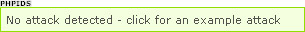

.. ==================================================
.. FOR YOUR INFORMATION
.. --------------------------------------------------
.. -*- coding: utf-8 -*- with BOM.

.. include:: ../Includes.txt

.. _users-manual:

Users manual
============

.. _installation:

Installation
------------

Install the extension with the Extension Manager.

The extension uses the hook ['SC_OPTIONS']['tslib/index_ts.php']['preprocessRequest'] to execute the plugin before any further processing is done.

After activation you should activate the debug mode in the constants and afterwards
get a message on top of your page: “No attack detected – click for an example attack”.

This Message shows you that the installation completed successfully. Now you can turn the message off by setting the Typo-Script variable General.debug_mode to 0. To do this choose “Template” in your Typo3 Backend. Then refer to the first page after the page with the globe-sign. Choose “Constant Editor” from the dropdown on top of the page. You should now see a new dropdown with a list of installed and configurable extension. Choose “MK_PHPIDS (27)”. See Section “Configuration” for details.

Note that most of the variables must not be changed since PHPIDS for TYPO3 is preconfigured and should fit most need.

.. _how-to-update:

How to update
-------------

From time to time you have to update the filer rules (default_filter.xml) and the converter (Converter.php).
This can be done by using the backend module PHPIDS → Update converter and filter → Start update
You can automate this procedure by adding PHPIDS to the TYPO3 Scheduler. To do this click on the backend module Scheduler → Add task → Choose “PHPIDS filter and converter update”. The task frequency should be once a week (for example “30 3 * * 0”).