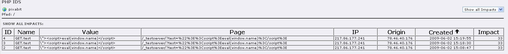

mkphpids
=======

**NOTE: This extension is abandoned as the development of PHPIDS was 
abandoned as well a long time ago. So no Support for TYPO3 9.5 
and later versions will be added. If you're interested in more security
in your TYPO3 environments you should check out 
[mksanitizedparameters](https://github.com/DMKEBUSINESSGMBH/typo3-mksanitizedparameters)
which prevents most attacks in the first place by sanitizing incoming 
request parameters making it harder for attackers.**

[Administration](Documentation/Administration/Index.md)

[Configuration](Documentation/Configuration/Index.md)

[UsersManual](Documentation/UsersManual/Index.md)

[ChangeLog](Documentation/ChangeLog/Index.md)

What does it do?
----------------

Adding a PHP Intrusion Detection System from <http://www.phpids.org> to
your TYPO3 Website.

This extension is a fork of px\_phpids with more features and TYPO3 6.2, 7.6 and 8.7
support. So thanx for the development of px\_phpids.

Features
--------

Quote from the Author of PHPIDS:

“PHPIDS (PHP-Intrusion Detection System) is a simple to use, well
structured, fast and state-of-the-art security layer for your PHP based
web application. The IDS neither strips, sanitizes nor filters any
malicious input, it simply recognizes when an attacker tries to break
your site and reacts in exactly the way you want it to. Based on a set
of approved and heavily tested filter rules any attack is given a
numerical impact rating which makes it easy to decide what kind of
action should follow the hacking attempt. This could range from simple
logging to sending out an emergency mail to the development team,
displaying a warning message for the attacker or even ending the user’s
session.

PHPIDS enables you to see who’s attacking your site and how and all
without the tedious trawling of logfiles or searching hacker forums for
your domain. Last but not least it’s licensed under the LGPL!”

On their site you can find a collection of resources related to PHPIDS.
These including files, documentation, a friendly forum and a demo which
shows some of the best features of PHPIDS.

Screenshots
-----------

The backend module.
